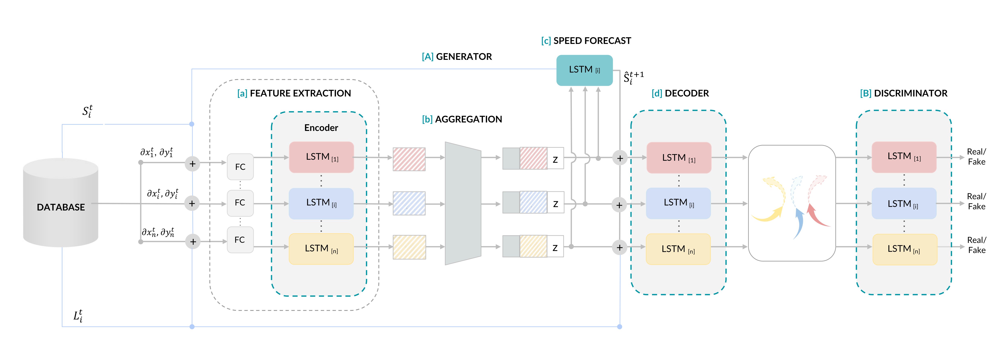

# **Conditional Generative Adversarial Networks for Speed Control in TrajectorySimulation**

Conditional Speed GAN (CSG): A generative system that can be conditioned on agent speed and semantic classes of agents, to simulate multimodal and realistic trajectories based on user defined control.

CSG Model Overview:
A) Generator Block, comprising of the following sub-modules: (a) Feature Extraction, that encodes the relative positions and speeds of each agent with LSTMs, (b) Aggregation, that jointly reasons multi agent interactions, (c) Speed forecast, that predicts the next timestep speed, (d) Decoder, that conditions on the next timestep speed, agent label and the agent-wise trajectory embedding to forecast next timesteps, and, the B) Discriminator Block, that classifies the generated outputs as “real” or “fake”, specific to the conditions
 

We show an example of agents moving at GT (left) and simulated max speed (right). Given a high speed, each agent intends to increase their speed of motion thus maximising the distance covered.


Another example depicting our model's control: GT (left) and Min speed (right). Given a speed of 0, agent tend to stop instantaneously.


### Datasets:
- ***For Single agent:***
    - Observed and Predicted length are 8 and 12 frames respectively.
    - Dataset: pedestrian_dataset (in the project folder)
    - For extrapolation, use pedestrian_dataset/extrapolation_dataset
- ***For Multi agent:***
    - Observed and Predicted length are 20 and 30 frames respectively.
    - Dataset: We use Argoverse dataset version v1.1 (https://www.argoverse.org/data.html#forecasting-link). For our work, we use 5126, 1678 files for train and test respectively 

### Flag descriptions:

- `H_DIM_GENERATOR_SINGLE_CONDITION`, `H_DIM_GENERATOR_MULTI_CONDITION`: hidden dimensions used for both encoder and decoder LSTM in G for single and multi agent respectively
- `H_DIM_GENERATOR_SINGLE_CONDITION`, `H_DIM_GENERATOR_MULTI_CONDITION`: hidden dimensions used in D for single and multi agent respectively.
- `EMBEDDING_DIM`: embedding dimension
- `MLP_INPUT_DIM_SINGLE_CONDITION`, `MLP_INPUT_DIM_MULTI_CONDITION`: input shape of MLP for single and multi agent respectively.
- `NOISE_DIM`: Gaussian noise dimension
- `G_LEARNING_RATE`, `D_LEARNING_RATE`: Learning rate of G and D
- `NUM_LAYERS`: Number of LSTM layers
- `DROPOUT`: Dropout to be used in the model
- `NUM_EPOCHS`: Number of epochs the model is to be trained. 
- `OBS_LEN`, `PRED_LEN`: Observed and predicted length of the trajectories
- `CHECKPOINT_NAME`: Path of the checkpoint at which the weights needs to be stored.
- `BATCH`: Batch size
- `BATCH_NORM`: Batch normalization option
- `ACTIVATION`: Activation functions used.
- `G_STEPS`, `D_STEPS`: The number of feed-forward and backward passes for generator and discriminator respectively.
- `NUM_SAMPLES`: Number of samples to test the model
- `NOISE`: Noise to be added.

### Aggregation Module Flags
- `AGGREGATION_TYPE`: 'pooling' for CSG-P, 'attention' for CSG-A, 'concat' for CSG-C, 'None' for 'CSG'

Note: In ETH/UCY, as each dataset has different max speed value, we implement a common threshold for max_value across all datasets and consider the speeds above the threshold as max_speeds.
In argoverse dataset, we set the ratio of low_speed:high_speed as 100:1.


## SPEED CONTROL FLAGS
- `TRAIN_METRIC`: We utilize the next speed information from the ground truth to train the model. This value always holds 0. 
- `TEST_METRIC`: For prediction environment use 1 and for Simulation environment use 2.  
- `STOP_PED_SINGLE_CONDITION`: This flag stops all the agents in Single-agent condition. This implies that a speed value of 0 is imposed on all the agents in ETH/UCY.
- `CONSTANT_SPEED_SINGLE_CONDITION`: This flags imposes a constant speed to all pedestrians in Single-agent condition. If set True, enter a value between 0 and 1 in CS_SINGLE_CONDITION variable
- `DIFFERENT_SPEED_MULTI_CONDITION`:  Used during Multi-agent simulation. If set True, enter a value between 0 and 1 to AV_SPEED, OTHER_SPEED, AGENT_SPEED.

## Pretrained Models:
The code was developed and tested using Python 3.7.x.
- For single-agent, `USE_GPU=1`:
    - `'NoAgg' folder`: contains 5 pretrained models for CSG.
    - `'PM' folder`: contains 5 pretrained models for CSG-P.
    - `'Concat' folder`: contains 5 pretrained models for CSG-C.
    - `'Attention' folder`: contains 5 pretrained models for CSG-A.
    - `'Extrapolation' folder`: contains 3 pretrained models for CSG-C (for minimum, medium and maximum speed folds).
- For multi-agent, `USE_GPU=0`:
    - `'MultiAgent' folder`: contains pretrained model for CSG for Argoverse dataset.
     
To reproduce the repo, follow the below steps:

Initially clone the repository and navigate to the project folder and run:
````
pip install -r requirements.txt
````

After successful installation of the libraries, select the required pre-trained model from `'Checkpoints'` folder and change the `CHECKPOINT_NAME` variable in constants.py to the selected pre-trained model path and activate the corresponding `AGGREGATION_TYPE` flag, change `TRAIN_DATASET_PATH`, `VAL_DATASET_PATH` and `TEST_DATASET_PATH` in constants.py according to Single/Multi condition. For Extrapolation feature, use `'pedestrian_dataset/extrapolation_dataset'`. For Extrapolation, the train, val and test datasets remains the same.

- For single-agent activate `SINGLE_CONDITIONAL_MODEL` and `USE_GPU` flag in constants.py and for multi-agent, activate `MULTI_CONDITIONAL_MODEL` flag and deactivate `USE_GPU` flag.

***For Simulation Environment:*** To simulate trajectories at different user-defined conditions, change `TEST_METRIC` = 2 in constants.py and select one of the below options according to Single/Multi condition:
- ***To simulate single-agent***: Change the flag `CONSTANT_SPEED_SINGLE_CONDITION` in constants.py to True and enter a value between 0 and 1 in CS_SINGLE_CONDITION variable  

- ***To simulate multi-agent***: Change the flag `DIFFERENT_SPEED_MULTI_CONDITION` to True and enter a value between 0 and 1 to AV_SPEED, OTHER_SPEED, AGENT_SPEED in constants.py.

***For Prediction Environment:*** To predict trajectories using the output of SR, change the `TEST_METRIC` flag to 1 in constants.py.

***Note:*** Either Simulation or Prediction can be performed at once. 

After changing the required flags, run:
````
python code/evaluate_model.py
````
***For Simulation:*** The output of the script enables the user to select the agent ids and the speed is verified for the user-selected agents.

***For Prediction:*** The ADE, FDE and CA metrics are given as output. 

To train the model from scratch, 

Change the `CHECKPOINT_NAME` in constants.py (provide a new filename), change the required aggregation flags and run:
````
python code/train.py
````

Implementation details can be found [here](Implementation_details.MD)

Detailed results of CSG on ETH and UCY dataset are as below:
 
| CSG | ADE/ FDE  |
|-----|-----|
| `ETH`| 0.81/ 1.50 |
| `Hotel`| 0.36/ 0.65 |
| `Univ`| 0.54/ 1.16 |
| `Zara1`| 0.36/ 0.76 |
| `Zara2`| 0.28/ 0.57 |
